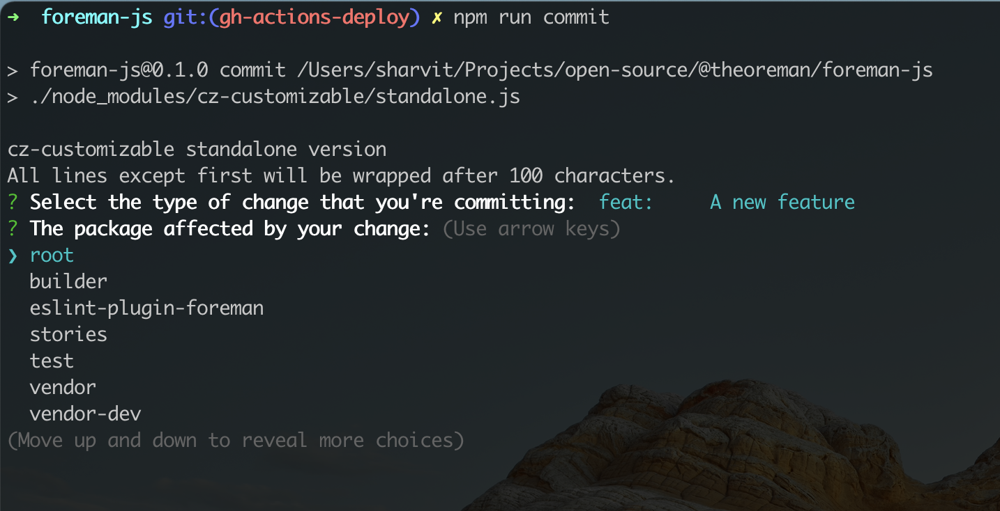
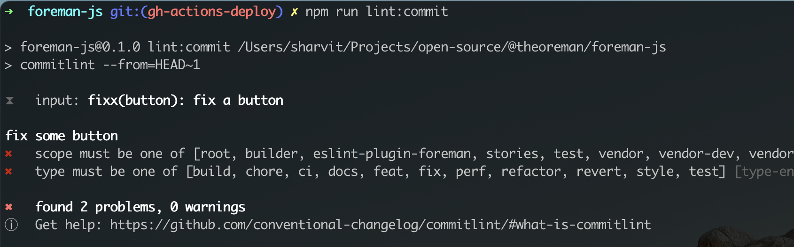

# Commit Message Format

- [About](#about)
- [The commit message format](#the-commit-message-format)
  * [Revert](#revert)
  * [Type](#type)
  * [package](#package)
  * [Subject](#subject)
  * [Body](#body)
  * [Footer](#footer)
    + [Referencing redmine issues](#referencing-redmine-issues)
    + [Referencing breaking changes](#referencing-breaking-changes)
    + [Examples](#examples)
- [Toolings](#toolings)
  * [Commit Generator](#commit-generator)
  * [Commit linter](#commit-linter)


# About

`foreman-js` automation uses the commit messages to determine the type of changes in the codebase. Following formalized conventions for commit messages, foreman-js automatically determines the next semantic version number, generates a changelog, and publishes the release to Github and npm.

# The commit message format

Each commit message consists of a **header**, a **body** and a **footer**.
The header has a special format that includes a **type**, a **package** and a **subject**:

```
<type>(<package>): <subject>
<BLANK LINE>
<body>
<BLANK LINE>
<footer>
```

The **header**, the **package** and the **subject** of the header are mandatory fields.

Any line of the commit message cannot be longer than 100 characters!
This allows the message to be easier to read on GitHub as well as in various git tools.

## Revert
If the commit reverts a previous commit, it should begin with `revert: `, followed by the header of the reverted commit.
In the body it should say: `This reverts commit <hash>.`, where the hash is the SHA of the commit being reverted.

## Type

Must be one of the following:

* **feat**: A new feature
* **fix**: A bug fix
* **docs**: Documentation only changes
* **style**: Changes that do not affect the meaning of the code (white-space, formatting, missing
  semicolons, etc)
* **refactor**: A code change that neither fixes a bug nor adds a feature
* **perf**: A code change that improves performance
* **test**: Adding missing or correcting existing tests
* **chore**: Changes to the build process or auxiliary tools and libraries such as documentation generation

## package

The package contains the name of the [main] package the commit is updating.

You can use `root` when the commit does not change any package but changes to the root monorepo.

## Subject

The subject contains a succinct description of the change:

* use the imperative, present tense: "change" not "changed" nor "changes"
* don't capitalize first letter
* no dot (.) at the end

## Body

Just as in the **subject**, use the imperative, present tense: "change" not "changed" nor "changes".
The body should include the motivation for the change and contrast this with previous behavior.

## Footer

The footer should contain any information about **Breaking Changes** and is also the place to reference Redmine issues.

### Referencing redmine issues

To reference redmine issues, add a new line to the footer with `fixes #<issue-id-1>, ..., #<issue-id-n>`, e.g.:

```
fixes #1234, #1236
```

### Referencing breaking changes

**Breaking Changes** should start with the word `BREAKING CHANGE:` with a space or two newlines.
The rest of the commit message is then used for this.

### Examples

Here is an example of the release type that will be done based on a commit messages:

| Commit message                                                                                                                                                                                   | Release type                       |
| ------------------------------------------------------------------------------------------------------------------------------------------------------------------------------------------------ | ---------------------------------- |
| `fix(vendor-core): upgrade @patternfly/react-table to v2.28.47`                                                                                                                                  | Patch Release (x.x.1)              |
| `feat(stories): add centered decorator`<br><br>`fixes #1927, #1931`                                                                                                                                       | ~~Minor~~ Feature Release (x.1.0)  |
| `feat(stories): update Storybook to v6`<br><br>`BREAKING CHANGE: The Preview component has been renamed to Canvas.`<br><br>`BREAKING CHANGE: The Props component has been renamed to ArgsTable.`<br><br>`fixes #1958` | ~~Major~~ Breaking Release (2.0.0) |

> Visit the [CHANGELOG.md](../CHANGELOG.md) and the [releases page on github](https://github.com/theforeman/foreman-js/releases) to see how the commit messages generate the changelog and the release notes.

# Toolings

To make life easier when dealing with commit messages, there are some toolings available.

## Commit Generator

To create a new commit with ease, run `npm run commit` and you'll be prompted to fill out any required commit fields at commit time.




## Commit linter

To validate your commit message, run `npm run lint:commit`, and you'll be informed about issues in your previous commit message if there are any.


